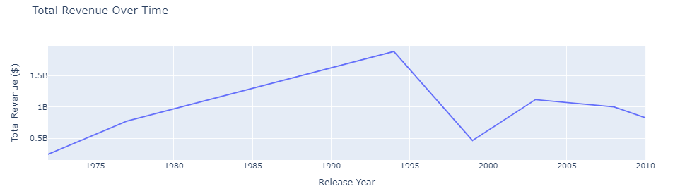
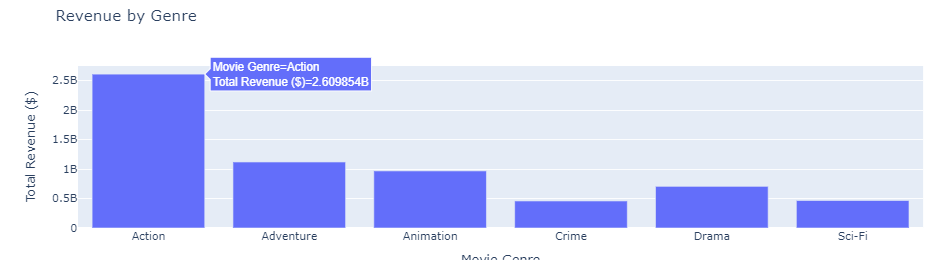
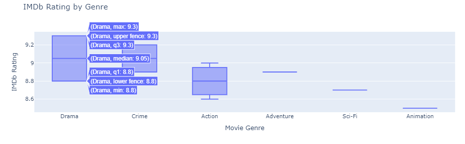
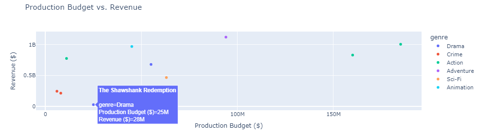
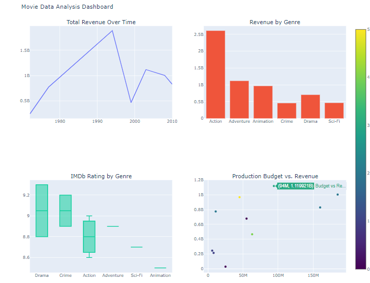

# Plotly Dashboard for Movie Data Analysis

## Introduction

I will create an interactive Plotly dashboard to analyze movie data. The goal is to combine multiple visualizations, such as revenue trends over time, genre distribution, movie ratings comparison, and box office performance, into a comprehensive, interactive dashboard.

### Starter Files

Create a file named `movies.csv` in the same directory as your script with the following data:

```csv
movie_title,release_date,genre,imdb_rating,revenue,production_budget,release_month,release_year
The Shawshank Redemption,1994-09-23,Drama,9.3,28000000,25000000,September,1994
The Godfather,1972-03-24,Crime,9.2,245000000,6000000,March,1972
The Dark Knight,2008-07-18,Action,9.0,1004558444,185000000,July,2008
Pulp Fiction,1994-10-14,Crime,8.9,213928762,8000000,October,1994
The Lord of the Rings: The Return of the King,2003-12-17,Adventure,8.9,1119920922,94000000,December,2003
The Matrix,1999-03-31,Sci-Fi,8.7,466500000,63000000,March,1999
Inception,2010-07-16,Action,8.8,829895144,160000000,July,2010
Forrest Gump,1994-07-06,Drama,8.8,678600000,55000000,July,1994
The Lion King,1994-06-15,Animation,8.5,968500000,45000000,June,1994
Star Wars: Episode IV - A New Hope,1977-05-25,Action,8.6,775400000,11000000,May,1977
```

## Design and Build an Interactive Dashboard Using Plotly

In this assignment, you will design and build a dashboard that consolidates various interactive visualizations into a single view. This will allow users to explore key insights from the movie data, including trends in revenue, movie genres, IMDb ratings, and production budgets.

## Requirements

- Design and build an interactive dashboard using Plotly.

- Integrate multiple visualizations to provide a comprehensive view of the data (revenue trends, genre distribution, movie ratings, and production budgets).

**Load and Explore the Data**

- Load the dataset `movies.csv` into a Pandas DataFrame.
- Display the first few rows to understand the structure of the data.

**Sample Output:**

```console
								 movie_title release_date     genre  imdb_rating      revenue  production_budget release_month  release_year
0                 The Shawshank Redemption   1994-09-23     Drama          9.3     28000000              25000000      September         1994
1                           The Godfather   1972-03-24     Crime          9.2    245000000               6000000          March         1972
2                         The Dark Knight   2008-07-18     Action          9.0    1004558444             185000000           July         2008
3                            Pulp Fiction   1994-10-14     Crime          8.9     213928762               8000000         October         1994
4  The Lord of the Rings: The Return of the King  2003-12-17   Adventure          8.9    1119920922              94000000     December         2003
```

**Revenue Performance Over Time (Line Chart)**

- Create a line chart that shows the total revenue over time (based on the release year).
- This will display trends in movie revenue over the years.



**Revenue by Genre (Bar Chart)**

- Create a bar chart to compare the total revenue for each movie genre. This will allow users to easily compare how different genres are performing.



**IMDb Rating by Genre (Box Plot)**

- Create a box plot to compare the IMDb ratings for different genres. This will show how movies within each genre are rated.



**Production Budget vs. Revenue (Scatter Plot)**

- Create a scatter plot to visualize how the production budget compares with the revenue for each movie.



**Final Dashboard Integration**

- Now, integrate all the visualizations into a single interactive Plotly dashboard using the `make_subplots` feature.



### **Key Points**

**Mapping Genres to Numeric Values:**

- A dictionary `genre_to_color` is created to assign a unique numeric ID to each genre.
- The `df['genre_color']` column is added to the dataframe, where each genre is mapped to its numeric ID.

**Using a Color Scale:**

- Instead of passing the genre strings directly to the `color` property of the marker, you now pass the numeric values from `df['genre_color']`.
- The `colorscale='Viridis'` is used to map the numeric values to a color scale. You can change the color scale to any other supported color scale, like `'Cividis'`, `'Rainbow'`, etc.

**Using `showscale=True:`**

- This will show the color scale on the side of the plot so that users can see the mapping between color and genre.

> Note: Plotly can handle numeric or categorical values for color, but it requires numerical inputs for color scaling. By mapping genres to unique numeric values, we can utilize Plotly's color scale to distinguish the genres visually. 


## Conclusion

In this assignment, you have loaded a movie dataset and explored its structure, gaining an understanding of key features such as revenue, genre, IMDb ratings, and production budgets. Through data analysis, you examined revenue trends over time, assessed genre performance, visualized IMDb rating distributions, and explored the relationship between production budgets and revenues. Using Plotly, you created several interactive visualizations, including line charts, bar charts, box plots, and scatter plots. These visualizations were then integrated into a cohesive, interactive dashboard that provides valuable insights into various aspects of the movie data. This interactive dashboard allows users to explore trends and gain deeper insights into the movie industry's financial performance, ratings, and genre distribution. As a result, you now have hands-on experience in building end-to-end interactive dashboards using Plotly!
